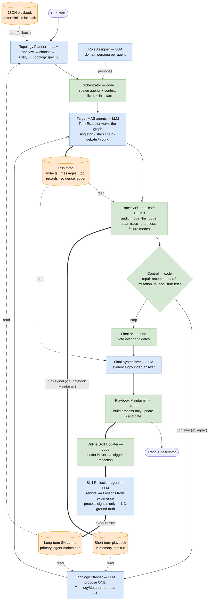

# Economic Analysis Framework for Multi-Agent Collaboration

This repo is the experiment harness behind [PAPER.md](PAPER.md). It runs single-agent systems (SAS) and multi-agent systems (MAS) on a shared benchmark suite, records structured execution traces, and converts repeated runs into a trace-derived descriptor that supports:

- quality vs cost analysis
- MAS vs SAS gain/cost comparison
- coordination diagnostics
- topology-level summary and Pareto analysis

The core goal is not only to ask whether MAS can help, but to measure when collaboration improves task outcomes enough to justify its execution and coordination cost.

## Core idea

Each task is executed one or more times under a fixed system configuration. For every run, the repo stores:

- benchmark-native evaluation output
- structured trace events
- run-level trace metrics
- a task-level descriptor aggregated over repeated runs

The descriptor follows the paper’s `Q / C / D / R / P` split while also exposing paper-facing aliases used directly in the draft:

- `Q`: outcome quality
- `C`: direct execution cost
- `D`: coordination diagnostics
- `R`: run-to-run reliability
- `P`: process structure

The paper defines higher-level economic quantities such as utility `U = Q - C`, collaboration gain `G`, and coordination cost `K`. This repo produces the trace-derived ingredients needed for those analyses.

## Agent Prompting And Tool-Use Design

The MAS runtime follows a supervisor/subagent design while keeping the current custom topology engine and provider-native OpenAI-compatible tool loop.

- Structural workflow roles remain authoritative: planner/orchestrator/worker/critic/aggregator roles determine routing, visibility, and output contract.
- Dynamic personas specialize the agent within that structural role. They do not override stage rules or tool requirements.
- Tool-enabled answer-producing stages are expected to call tools when evidence is missing or weak. The runtime does not fabricate tool calls or synthetic retrieval after the fact.
- Final judges and deterministic fallbacks prefer direct, evidence-backed answers over blocked-status, planning-only, or "no evidence" outputs.
- Context sharing is explicit. Agents see only task messages, selected relay packets, their prior artifact, and the tool outputs they actually received.

This design aligns with current primary-source guidance on agent systems:

- OpenAI, *A practical guide to building agents*: start with clear instructions, explicit tool loops, and manager-pattern orchestration when specialization is useful.
- LangChain, *Subagents*: the main agent should see concise subagent outputs and treat tool/subagent descriptions as routing levers.
- LangChain, *Handoffs*: explicit context engineering matters; malformed or overly broad context degrades multi-agent behavior.
- LangChain, *Deep Agents overview*: keep the main context clean and isolate specialized work into bounded subagent contexts.

References:

- https://cdn.openai.com/business-guides-and-resources/a-practical-guide-to-building-agents.pdf
- https://docs.langchain.com/oss/python/langchain/multi-agent/subagents
- https://docs.langchain.com/oss/python/langchain/multi-agent/handoffs
- https://docs.langchain.com/oss/python/deepagents/index

## Exact metric contract

The metric contract is intentionally strict and reproducible.

### Run-level outcome variables

For one run `r`:

- `success_r = 1` iff `benchmark.evaluate(...).success` is `True`
- `completion_r = 1` iff the run produced a final artifact / final answer and did not terminate with an explicit runtime failure signal

Important:

- `success` is benchmark correctness
- `completion` is execution completion
- `completion` does **not** imply correctness

So a wrong answer can still have `completion = 1` and `success = 0`.

At the benchmark level for a fixed MAS:

- `success_rate` means: among all benchmark sample runs, what fraction were solved correctly
- `completion_rate` means: among all benchmark sample runs, what fraction finished execution and produced a final answer/artifact without an explicit runtime failure

Equivalently:

- `success_rate`: "How many samples did this MAS actually solve?"
- `completion_rate`: "How many sample runs did this MAS complete successfully as executions?"

### Run-level trace totals

For one run `r`, the trace code computes:

- `latency_total_r = sum(event.latency_ms)`
- `tokens_total_r = sum(event.token_in + event.token_out)`
- `cost_total_r = sum(event.cost_usd)`
- `tool_calls_total_r = count(event_type == "tool_call")`
- `tool_fail_total_r = count(tool failures)`
- `steps_total_r = number of trace events`
- `backtrack_rate_r = (#revise events + payload.redo) / steps_total_r`
- `loop_score_r = repeated-state or repeated-pattern ratio from the trace`
- `verification_density_r = #verify / steps_total_r`
- `communication_count_r = directed relay/message edges from all inter-agent sends, including system-mediated sends`
- `communication_agent_to_agent_count_r = directed send edges whose sender is a non-system agent`
- `communication_system_mediated_count_r = directed send edges whose sender is system / mediator`
- `handoff_count_r = actor switches across consecutive non-system events`

### Task-level descriptor aggregation

Given `N` repeated runs for the same task and system:

**Quality**

- `Q1_success_rate = mean_r(success_r)`
- `Q2_completion_rate = mean_r(completion_r)`

**Execution cost**

- `C1_latency_p95 = p95_r(latency_total_r)`
- `C2_tokens_total = mean_r(tokens_total_r)`
- `C3_cost_total = mean_r(cost_total_r)`
- `C4_tool_calls_total = mean_r(tool_calls_total_r)`

**Coordination diagnostics**

- `D1_tool_error_rate = sum_r(tool_fail_total_r) / sum_r(tool_calls_total_r)`
- `D2_communication_count = mean_r(communication_count_r)`
- `D2_agent_to_agent_communication_count = mean_r(communication_agent_to_agent_count_r)`
- `D2_system_mediated_communication_count = mean_r(communication_system_mediated_count_r)`
- `D3_handoff_count = mean_r(handoff_count_r)`

These `D*` metrics are logged as coordination diagnostics. They are not part of the paper’s direct execution-cost definition `C`.

**Reliability**

- `R1_success_var = Var_r(success_r)`
- `R2_latency_var = Var_r(latency_total_r)`
- `R3_tokens_var = Var_r(tokens_total_r)`

**Process**

- `P1_steps_total = mean_r(steps_total_r)`
- `P2_backtrack_rate = mean_r(backtrack_rate_r)`
- `P3_loop_score = mean_r(loop_score_r)`
- `P4_verification_density = mean_r(verification_density_r)`

### Paper-facing task metrics

The task descriptor also writes paper-facing fields directly so downstream scripts do not need to reconstruct them:

- `success_rate = Q1_success_rate`
- `pass_at_1`, `pass_at_3`, `pass_at_5`, `pass_at_8` using the paper’s pass@k estimator over repeated runs
- `stability = clip(1 - R1_success_var / 0.25, 0, 1)` when `N >= 2`, otherwise blank
- `eval_avg_score = mean_r(score_r)`
- `tokens_total = C2_tokens_total`
- `cost_per_success = tokens_total / success_rate` when `success_rate > 0`, otherwise blank
- `tokens_cv = std_r(tokens_total_r) / mean_r(tokens_total_r)` when `N >= 2` and mean tokens are positive, otherwise blank
- `tool_calls_total = C4_tool_calls_total`
- diagnostic aliases: `tool_error_rate`, `communication_count`, `handoff_count`

Interpretation notes:

- `stability` and `tokens_cv` require repeated runs and are blank for single-run tasks
- `pass_at_k` is blank when fewer than `k` repeated runs are available
- `cost_per_success` is blank when the system never succeeds on that task

### What appears in `summary.csv`

Per task and system, `summary.csv` includes:

- `eval_avg_score`: benchmark-native mean score across runs
- `eval_success_rate`: benchmark-native mean boolean success across runs
- `eval_completion_rate`: runtime completion rate across runs
- paper-facing descriptor fields such as `success_rate`, `pass_at_3`, `stability`, `tokens_total`, `cost_per_success`, `tokens_cv`
- compatibility fields such as `Q1_success_rate`, `C2_tokens_total`, `D2_communication_count`, `P3_loop_score`, etc.

By design:

- `Q1_success_rate` should match `eval_success_rate`
- `Q2_completion_rate` should match `eval_completion_rate`

If those pairs disagree, that indicates a bug in the artifact pipeline.

Interpretation by level:

- per run: `success` and `completion` are binary `0/1`
- per task with repeated runs: `Q1_success_rate` and `Q2_completion_rate` are proportions over that task's repeated runs
- per benchmark for one MAS: average those task-level values across all samples in the benchmark to get the benchmark-level success/completion rates

## Workflow termination logic

Looped MAS stages such as debate, representative exchange, and orchestrator cycles do not stop implicitly. A controller node calls `_termination_decision(...)` in `MAS/langgraph_engine.py` and computes explicit stop statistics from the current stage artifacts.

### Inputs

For one controller decision:

- `candidate_artifacts`: the current artifacts that would be revised if the loop continues
- `previous_candidate_artifacts`: the previous-step artifacts for the same agents, used to measure change
- `consensus_artifacts`: the artifacts whose answers are compared for agreement
- `expected_count`: how many active branches or agents were expected to produce an artifact

### Branch artifact count

The code first counts:

- `valid_artifact_count = count(non-empty branch artifacts available at the current controller step)`

If `valid_artifact_count < ceil(expected_count / 2)`, the stage stops with `invalid_or_failed_branch`.

Interpretation:

- this is a branch-survival check
- if fewer than half of the expected branches produced any usable artifact at all, the collaboration stage is considered too broken to continue
- blocked or planning artifacts do not count as good final answers, but they no longer trigger branch-collapse handling by themselves

### Consensus ratio

By default, the repo computes termination consensus with an LLM judge:

- `mas.termination_consensus_mode = "llm_judge"` by default
- the judge uses the system model route `models.judge` if provided, otherwise `models.default`
- the controller sends the current task prompt plus the candidate answers to the judge
- the judge returns JSON groups of semantically equivalent answers

The JSON schema is:

- `groups`: lists of artifact indices that express the same final answer
- `invalid_indices`: indices the judge considers unusable or non-answers
- `is_substantive`: whether the largest agreement group is an actual task answer
- `progress_status`: `improving | stalled | unclear`
- `expected_improvement`: `high | medium | low`
- `should_stop_for_no_progress`: whether another round is unlikely to materially improve correctness
- `explanation`: short rationale

The controller then computes:

- `winner_count = size of the largest judged equivalence group`
- `valid_count = number of valid answers after removing invalid_indices`
- `consensus_ratio = winner_count / valid_count`

The stage stops with `consensus_reached` when:

- `valid_count > 1`
- `consensus_ratio >= 0.75`
- the semantic judge marks the majority answer as substantive
- the agreement is **decision-grade**: average confidence is `>= 0.5` and no agent still
  lists unresolved issues — *or* no further step (another round / the single repair) is available

Interpretation:

- consensus here is semantic agreement as judged by the termination judge, not exact string identity
- if the judge clusters 3 of 4 valid answers together, `consensus_ratio = 0.75`
- the decision-grade gate mirrors the Trace Auditor's `premature_consensus` check, so the controller never stops on a uniformly low-confidence (or unresolved) agreement while a repair or another round could still improve it; when no step remains, agreement always stops the loop (no infinite loops). The `consensus_ratio` metric itself is unchanged, and the decision logs `consensus_gate_blocked` / `consensus_gate_reason`.
- this consensus check is still a workflow-control heuristic, not the benchmark evaluator and not the final correctness decision

Fallback behavior:

- if `mas.termination_consensus_mode = "lexical"`, the repo uses deterministic normalized-string voting
- if `mas.termination_consensus_mode = "llm_judge"` but the judge is unavailable, running in mock mode, or returns unusable JSON, the controller falls back to lexical consensus

The lexical fallback canonicalizes each answer by lowercasing, removing non-alphanumeric characters, and collapsing whitespace, then computes the same `winner_count / valid_count` ratio over exact normalized matches.

Final answer aggregation is separate from this stop-condition ratio. Final answer selection is configurable and can fall back to deterministic `vote_artifacts(...)` after the loop ends.

You can also configure final answer selection separately:

- `mas.final_vote_mode = "llm_judge"` by default
- the final judge sees the task prompt plus the candidate answers and returns JSON with semantic groups, a `winner_index`, optional `invalid_indices`, and a short explanation
- if the final judge is unavailable, running in mock mode, or returns unusable JSON, the repo falls back to deterministic `vote_artifacts(...)`

### Average confidence

Each artifact carries a `confidence` field produced by the agent JSON output schema. During artifact construction:

- the parsed value is converted to `float`
- it is clipped into `[0, 1]`
- if missing or unparsable, it defaults to `0.5`

Then:

- `average_confidence = mean(artifact.confidence)`

across the current `candidate_artifacts` (or `consensus_artifacts` if needed).

Interpretation:

- this is self-reported model confidence averaged over the active artifacts
- it is logged as a diagnostic only and does not directly terminate a run
- the prompt now defines confidence as confidence in the current `answer_artifact`, not general optimism

### Progress / stall judgment

In `llm_judge` mode, `no_meaningful_change` is semantic. The termination judge sees the current candidate artifacts plus each agent's previous answer when available and decides whether another round is likely to materially improve correctness.

The stage stops with `no_meaningful_change` when:

- previous comparable artifacts exist
- the semantic judge returns `should_stop_for_no_progress = true`

Fallback behavior:

- if the termination judge is unavailable, mocked, or unparsable, the repo falls back to lexical change detection
- lexical fallback computes `mean_delta` with `difflib.SequenceMatcher`
- lexical fallback stops when `mean_delta <= 0.05`

`mean_delta` is still logged for compatibility, but in successful `llm_judge` mode it is diagnostic rather than the stop criterion.

### Max-round stop

The stage stops with `max_rounds_reached` when the topology-specific configured round or discussion limit has been exhausted.

Important:

- `mas.minimum_discussion_rounds` applies only to discussion/debate controllers
- outer collaboration cycles are controlled by `rounds`
- `rounds=1` means one outer cycle; it does not force a second pass

### Stop order

The checks are applied in this order:

1. `invalid_or_failed_branch`
2. `consensus_reached` (only when the agreement is decision-grade — see Consensus above)
3. `no_meaningful_change`
4. `max_rounds_reached`

So if multiple conditions are true, the first one in this list is the recorded stop reason.

### What gets logged

Each termination decision logs:

- `reason`
- `reason_detail`
- `consensus_mode`
- `consensus_source`
- `consensus_ratio`
- `consensus_gate_blocked` / `consensus_gate_reason`
- `consensus_groups`
- `consensus_explanation`
- `progress_source`
- `progress_status`
- `expected_improvement`
- `progress_explanation`
- `average_confidence`
- `mean_delta`
- `valid_artifact_count`
- control-step `token_in`, `token_out`, `latency_ms`, `cost_usd` when an LLM judge call is used

These values are workflow-control diagnostics. They determine whether a collaboration loop continues, but they are not benchmark quality metrics like `success_rate`.

## Trace schema

Each run writes a JSONL trace. A trace event contains:

- `timestamp_start`, `timestamp_end`
- `actor`
- `event_type`
- `payload`
- `token_in`, `token_out`
- `latency_ms`, `cost_usd`
- optional `state_id`

Supported event types:

- `plan`
- `act`
- `tool_call`
- `tool_result`
- `verify`
- `revise`
- `finalize`
- `error`

The schema is designed so all run-level trace metrics are recomputable from logs.

## Artifact semantics

For each run:

- `run_<n>.trace.jsonl`: raw trace events
- `run_<n>.answer.txt`: final answer text
- `run_<n>.metadata.json`: runtime metadata from the MAS execution
- `run_<n>.eval.json`: benchmark-native score and correctness
- `run_<n>.trace_metrics.json`: run-level outcome + trace totals + stage metrics
- `run_<n>.result.json`: compact run summary
- `run_<n>.trajectory.json` / `.md`: communication trajectory export

For each task:

- `descriptor.json`: aggregated task descriptor
- `descriptor.csv`: flat CSV version of the descriptor
- `analysis.json`: evaluation summary, descriptor, stage bottleneck hints
- `task_summary.json`: task-level summary across runs

For each system:

- `mas_graph.png` / `.mmd`: agent-topology graph
- `workflow_graph.png` / `.mmd`: workflow/control-flow graph
- `summary.json`: task summaries for the system
- `summary.csv`: one row per task for the system

For a hierarchical batch experiment:

- `artifacts/full_experiment/<experiment-id>/<benchmark>/<system>/<task_id>/...`
- benchmark/system rollups under the same root
- `experiment_summary.json` and `experiment_summary.csv` at the experiment root

## Repository layout

- `benchmark/`: benchmark adapters and evaluation logic
- `benchmarks/`: benchmark overview docs
- `MAS/`: SAS/MAS runtimes and LangGraph topologies
- `MAS/self_evolved/`: query-conditioned dynamic topology system (see below)
- `descriptor/`: trace schema, run metrics, task descriptor aggregation, topology analysis
- `scripts/`: experiment and analysis helpers
- `config/`: experiment configs
- `main.py`: CLI entrypoint

## Quickstart

### 1. Install

```bash
uv sync
```

or

```bash
python -m venv .venv
source .venv/bin/activate
pip install -e .
```

### 2. Create a config

```bash
cp config/experiment.example.toml config/experiment.toml
```

OpenRouter credentials can be set in `config/experiment.toml` or through `OPENROUTER_API_KEY`.

### 3. Inspect available benchmarks

```bash
python main.py list-benchmarks
python main.py benchmark-info --benchmark browsecomp --config config/experiment.toml
```

### 4. Run one experiment

```bash
python main.py run \
  --config config/experiment.toml \
  --benchmark browsecomp \
  --task-limit 1 \
  --runs-per-task 1
```

### 5. Summarize a hierarchical experiment

```bash
python main.py summarize-experiment --experiment-root artifacts/full_experiment/<experiment-id>
```

## Batch experiments

The main batch wrapper is:

```bash
bash scripts/full_experiment.sh
```

Useful environment variables:

- `TASK_LIMIT`
- `RUNS_PER_TASK`
- `BENCHMARKS` (optional; when unset the wrapper runs all discovered benchmark configs)
- `EXPERIMENT_ID`
- `OUTPUT_ROOT`

Useful CLI patterns:

```bash
bash scripts/full_experiment.sh --list-benchmarks
bash scripts/full_experiment.sh --benchmark workbench --benchmark scicode
bash scripts/full_experiment.sh --benchmarks browsecomp,workbench
RUNS_PER_TASK=8 bash scripts/full_experiment.sh --benchmarks browsecomp,workbench
```

Hierarchical outputs are written under:

```text
artifacts/full_experiment/<experiment-id>/<benchmark>/<system>/<task_id>/
```

## Self-evolved topology system

Setting `topology = "self_evolved"` in `[mas]` replaces the fixed layout with one
the system designs per task (`MAS/self_evolved/`). Instead of running a
hand-picked topology, each run plans its own agent graph from the query, executes
it, audits its own trace for failure modes, and is allowed **at most one**
structural repair before finalizing. It flows through the same CLI, artifact
hierarchy, and `summary.csv` as every other system, so it stays Q/C/D/R/P-comparable
to SAS and fixed MAS.

The orchestration is deterministic code; the LLM decides graph *shape* and does the
agent reasoning, but never decides when the loop stops. `benchmark.evaluate(...).success`
remains the only correctness authority — the in-run auditor never sees ground truth.

### Workflow diagram

Node fill marks the kind of component: **blue = LLM agent**, **green = deterministic
code**, **orange = state store**. **Solid arrows** are control flow / writes; **dashed
arrows** are reads. So you can read off *who writes each store and who reads it*.



Reading the stores off the diagram:

- **Run state** — written by the **Target-MAS agents** (and the synthesizer); read by the
  **Auditor** and **Synthesizer**.
- **Short-term playbook** — written each turn by the **Playbook Maintainer** (code) from the
  auditor's findings; read only by the **Planner** when it proposes the in-run mutation.
- **Long-term SKILL.md** — written by the **Skill Reflection agent** (LLM) every N runs from
  **process signals only**; read by the **Planner** for *both* the initial plan and the
  mutation. (The **JSON playbook** is the deterministic fallback when no skill file exists,
  written offline by `update_topology_playbook.py` — also process-only.)

The only LLM agents are the **Planner** (plan + mutate), the **Role Assigner**, the
**Target-MAS agents**, the **Final Synthesizer**, the **Skill Reflection agent**, and the
**Auditor** *only* under `audit_mode = "llm_judge"`. Everything else — orchestration,
control, the maintainer, the updater, visibility — is deterministic code. No agent ever
sees the benchmark verdict.

### Turn lifecycle

Each run executes this loop (`MAS/self_evolved/engine.py::run`, with `max_turns = 2`):

1. **Plan** — load the long-term skill (`config/topology_skill.md`, or the JSON playbook
   fallback), then the LLM **Topology Planner** proposes a per-task `TopologySpec` (nested
   agents/groups + per-agent context policy). The
   planner prompt is an *analyze → choose → justify* scaffold: it first analyzes the
   task along three axes — **task type** (retrieval/search, reasoning, coding, tool use,
   state mutation, verification, planning, comparison, summarization…), **attributes**
   (ambiguity, need for parallelism/debate/verification, hallucination risk, whether
   external state is mutated, whether outputs aggregate), and **failure risks**
   (duplicated writes, thin search coverage, premature consensus, weak verification,
   poor decomposition) — then picks the topology that analysis implies and says what
   each agent does. The prompt carries **general, task-characteristic** topology
   guidance (no benchmark names): broad retrieval → several parallel searchers on
   different facets; dependent clue-chains → chain/debate (shared context); factuality
   risk → a verifier that re-checks evidence; **external state mutation → exactly one
   executor (singleton/chain), never a parallel write**; ambiguity → debate/voting;
   multi-part → star or tree. The planner's `task_analysis` is folded into the plan
   rationale so it is visible in the trace and the playbook candidate. If the LLM is
   mocked, unparseable, or errors, it falls back to a deterministic spec (`sas` for one
   agent, else `orchestrator_no_discussion`) and flags `used_fallback`.
2. **Spawn** — project the spec to a real layout, assign domain personas, init state.
3. **Execute** — the **Turn Executor** walks the graph depth-first and runs each group
   by its pattern (`singleton` / `star` / `chain` / `debate` / `voting`). All agent
   work reuses the standard stage runner, so prompts, the tool loop, artifacts, and
   trace events match fixed MAS.
4. **Audit** — the **Trace Auditor** scans the turn's artifacts and tool records for
   process-observable failure modes: `tool_error_cascade`, `branch_collapse`,
   `evidence_lost_before_synthesis`, `premature_consensus`, `message_compaction_loss`,
   `missing_validator`, plus two coverage/side-effect modes —
   **`insufficient_search_coverage`** (a retrieval run that searched but opened no
   document, or had fewer than two agents searching a broad question) and
   **`duplicate_state_mutation`** (the same `(tool, arguments)` issued by ≥2 agents this
   turn, i.e. a double-applied write). (`audit_mode = "llm_judge"` adds an LLM
   refinement pass.) Each mode carries an actionable recommendation (e.g. "add searcher
   workers on different facets", "serialize the write through one executor").
5. **Control** — deterministic ordered checks decide stop vs. continue. The *only*
   continue path is: the audit recommends a repair, no mutation has been used yet, and
   a turn remains. Otherwise the run finalizes.
6. **Mutate** (continue path only) — the planner proposes one `TopologyMutation`
   (e.g. expand a leaf into a star or debate group, change a group pattern, add a
   searcher, collapse parallel workers into a chain to serialize a write). The mutation
   prompt carries the same long-term **skill** as the initial plan (so accumulated
   lessons shape the repair, not just the first design), the **short-term** turn memory,
   and a symptom→op cheatsheet so the audit verdict maps to a concrete op. It is applied
   once, visibility is revalidated, and the new spec runs one more turn. **Mutations are
   agent-additive** — agents are only ever added (`add_agent`, `expand_agent_to_group`),
   never deleted — but the graph is otherwise editable in place: `set_group_pattern`
   rewires a group's collaboration mode, `add_edge`/`remove_edge` adjust peer visibility,
   and `set_context_policy` retunes an agent's evidence access. Hard caps:
   `max_total_agents` and one mutation per run.
7. **Finalize** — vote over the final candidates (deterministic or judge). Evidence-grounded
   re-synthesis runs not only when the pick is empty/planning/blocked but also on a **weak pick**
   (an unbroken vote tie, winner confidence `< 0.5`, or open unresolved issues), and is skipped
   when no tool evidence exists — so confident, agreed answers are never disturbed. Then record a
   **process-only** playbook update candidate (topology shape, auditor modes, termination signals —
   never the eval verdict) into `run_metadata`.

The resulting trace reads `plan → spawn → turn 0 → audit → (revise) → turn 1 → finalize`,
with meta-agent tokens/cost on their own events so `C*` includes meta-control overhead.

### Playbook (two timescales)

- **Short-term** — an in-memory playbook, scoped to the **current run only** and never
  persisted. After each audited turn the Playbook Maintainer records the turn's process
  signals (detected modes, repair recommendation, termination reason) into it; the single
  in-run repair planner reads it back, giving the mutation fresh turn-level context. It is
  born and dies with the run — it is *experience within a task*, not across tasks.
- **Long-term — an agent-maintained markdown skill.** The long-term playbook is a
  long-form `SKILL.md` (default `config/topology_skill.md`) that the planner loads **in
  full** — at both plan time and repair-mutation time — the way an agent consults a skill.
  It is *experience across tasks and runs*. It has three sections:
  - **Standing principles** — benchmark-agnostic laws always in force.
  - **How to choose a topology** — the task-type → topology heuristics.
  - **Lessons from experience** — concrete, evidence-cited rules grown from real runs
    (e.g. *"tool-using broad retrieval: chain/3 ran clean 2/2 where star/3 flagged
    insufficient_search_coverage 3× — breadth and document reading both matter"*).

  **No ground truth in the playbook — this is a research-validity requirement.** Ranking
  the long-term memory by `benchmark.evaluate(...).success` would leak the held-out label
  into the system under study, so the planner would effectively be reading the answer key.
  Instead every run contributes a **process-only proxy** — `is_process_clean`: the run is
  "clean" when the auditor flagged no failure modes *and* it reached decision-grade
  consensus. `benchmark.evaluate(...).success` stays the sole authority for *scoring*, but
  it never enters the planner's memory.

  **Writer = an LLM reflection agent.** Reflection gives the model the current skill plus
  recent runs summarized by **process signals only** (each run's `playbook_update_candidate`
  → clean/flagged + the auditor's flagged modes; `summary_from_candidate`) and asks it to
  rewrite the *Lessons* section in terms of which topologies run cleanly / avoid process
  failures — never "correctness". The Standing-principles / How-to-choose sections are
  protected (a guardrail rejects any revision that drops them; a mocked, too-short, or
  non-markdown reflection leaves the skill unchanged).

  - **Online (in-experiment) — the default, and the intended mental model.**
    `skill_update_batch_size = N` (default **8**) under `[self_evolved]`. A single `run`
    command accumulates each freshly executed run's process-signal candidate and, **every N
    runs, pauses, reflects that batch into the skill, saves it, and reloads it**
    (`SelfEvolvedEngine.reload_skill`) so every subsequent run plans (and mutates) against
    the updated skill. Because the run loop is single-threaded, "pause → update → resume" is
    exactly what happens — the system genuinely self-evolves *during* the experiment. ⚠️ It
    writes a shared file mid-experiment, so run **one sequential process** — concurrent
    writers (e.g. parallel benchmarks in `scripts/full_experiment.sh`) would race; set
    `skill_update_batch_size = 0` for those. A trailing partial batch (< N) is picked up by
    the offline pass.
  - **Offline (opt-out / re-reflection).** Set `skill_update_batch_size = 0` to disable
    online writes (parallel-safe), then re-reflect over a finished experiment with
    `python scripts/reflect_topology_skill.py --experiment-root <dir> --config <toml>`. It
    reads the same process-signal candidates from disk — **not** `eval.json` — so it stays
    ground-truth-free too.

  *Deterministic fallback.* When no skill file exists, the planner falls back to the legacy
  structured JSON playbook (`config/topology_playbook.json`): benchmark-agnostic
  `principles[]` plus per-`benchmark::tools|size`-key `entries[]` whose `notes` distil a
  `best (cleanest)/avoid` rule, retrieved in three tiers (exact key → same benchmark → **same
  task shape across other benchmarks**, the transfer tier). It is written offline by
  `scripts/update_topology_playbook.py`, which merges run candidates **ranked by the same
  process proxy** (deterministic, no LLM, no `eval.json`). The markdown skill is the primary
  memory; the JSON is the fallback/record. Both keep the benchmark verdict out of the loop.

### Design notes: roles, mutation, and state

**Does the planner assign agent roles?** Two layers, only one of them the planner's:

- **Structural roles** (`coordinator` / `worker` / `debater` / `voter` / `verifier`) — the
  planner sets these *implicitly*. It picks a group **pattern** and an optional `verifier`
  flag; deterministic code (`planner._build_spec`, `_apply_*` for mutations) expands that
  shape into concrete per-agent structural and stage roles. The planner chooses the
  topology; code derives the roles.
- **Domain personas** (e.g. *"flights API specialist"*) — **not** the planner. A separate
  **Role Assigner** (`MAS/role_assigner.py`, an independent LLM call in
  `engine._assign_personas`, with a deterministic fallback) attaches a benchmark-specific
  persona to each agent. Agents added by a mutation get deterministic personas with no extra
  LLM round-trip. Per the prompt-priority invariant, personas never override stage behavior.

**Is the mutation add-only?** **Agents are add-only** — there is no remove-agent op, so the
agent set grows monotonically and is bounded by `max_total_agents`. The rest of the graph is
**editable in place**: `set_group_pattern` changes a group's collaboration mode (e.g.
parallel → chain to serialize a write), `add_edge`/`remove_edge` adjust peer visibility, and
`set_context_policy` retunes an agent's evidence access. So: additive in agents, mutable in
structure, at most one mutation per run.

**How does the orchestration manage state across a mutation?** The run owns **one mutable
`state` dict** for its whole life; a mutation never resets it.

- **Nothing accumulated is discarded.** `messages`, `artifacts`, `tool_records_log`, and the
  append-only **evidence ledger** carry across the mutation, so turn-2 agents (including
  newly spawned ones) see turn-1 work.
- **The mutation only swaps the graph.** Code installs the new `TopologySpec`, refreshes
  `layout`, and calls `context.set_spec(new_spec)`; visibility reads are **lazy**, so they
  simply recompute against the new topology — no migration step. New agent ids get budget +
  persona bookkeeping (`_register_new_agents`); existing agents keep their counters.
- **Visibility is code, never prompts.** `SharedContextController` + each agent's
  `ContextPolicy` apply recipient/kind/round filtering, latest-per-sender selection, sender
  share-scope, and optional summary-only/packet bounds.
- **Everything is logged for replay.** Every `TopologySpec` lands in
  `topology_spec_versions`; a `context_state_versions` snapshot is appended on spawn and on
  each mutation; meta-agent (planner/auditor/synthesizer) tokens ride their own trace events
  so `C*` includes meta-control overhead. Agents never decide termination — the controller
  does — and `benchmark.evaluate(...).success` stays the sole correctness authority **for
  scoring**; it is deliberately kept out of the planner's playbook (which learns from process
  signals only), so the self-evolved system never trains on the verdict it is measured by.

### Correctness nets and provisioning (deterministic code)

Two failure modes a 31B-class planner will not reliably avoid on its own are handled in
code, independent of the prompt:

- **Duplicate side-effects** — `TurnExecutor` keeps a per-run ledger of executed
  `(tool, arguments)` signatures and drops a tool record whose signature already ran, so an
  identical state-changing call (e.g. `calendar.create_event`) is recorded — and therefore
  replayed by the evaluator — **exactly once** even if parallel workers each issue it.
  Distinct arguments are always kept, so diverse parallel search is unaffected.
- **Retrieval breadth** — retrieval runs (those exposing `get_document`) run a single turn
  (no repair doubling) and keep the full configured agent budget instead of the 3-agent cap
  used for other tool tasks, because broad multi-hop search needs several searchers covering
  different facets; a near-single searcher is the dominant retrieval failure.

### Config and backend

```toml
[self_evolved]
harness_backend = "openrouter"   # or "claude_agent_sdk"
max_initial_agents = 5
max_total_agents = 10            # hard cap after the repair mutation
max_turns = 2                    # one initial turn plus at most one repair
audit_mode = "heuristic"         # or "llm_judge"
playbook_path = "config/topology_playbook.json"
skill_path = "config/topology_skill.md"   # the long-term agent-maintained skill
playbook_read = true             # planner reads the skill (used in BOTH plan and mutation)
skill_update_batch_size = 8      # default 8: reflect into the skill online every N runs (use one
                                 # sequential process). 0 = off (offline only, parallel-safe)
default_packet_max_chars = 0     # 0 = full fidelity; a positive value is a generous structural-compaction budget
```

The expert-agent harness is switchable via `harness_backend`: `"openrouter"` (default,
mock mode preserved for offline tests) or `"claude_agent_sdk"` (needs
`pip install -e ".[claude]"` and `ANTHROPIC_API_KEY`). `C*` cost metrics are not directly
comparable across backends — the Claude Agent SDK runs its own internal agent loop, so its
per-stage token/latency totals are cumulative — so treat the backend as an experiment dimension.

### Verification on hard, previously-failed examples

The optimization above was verified on the hardest examples where the original self-evolved
system lost to the static MAS baseline
(`artifacts/full_experiment/20260427T134706Z__google_gemma_4_31b_it_nitro`), model
`google/gemma-4-31b-it:nitro`, **1 run per task**:

| benchmark | task | failure mode | SAS | best static | old self-evolved | **optimized self-evolved** |
|---|---|---|----:|----:|----:|:--|
| workbench  | multi_domain_25 | duplicate write | 3/3 | 3/3 | 1/3 | **✅ pass** (chain, 1 write) |
| workbench  | multi_domain_28 | duplicate write | 3/3 | 3/3 | 1/3 | **✅ pass** |
| workbench  | multi_domain_29 | duplicate write | 3/3 | 3/3 | 1/3 | ❌ fail¹ |
| browsecomp | 791             | under-search + no read | 0/3 | 3/3 | 0/3 | **✅ pass** → `JadaL` |
| browsecomp | 796             | under-search + no read | 0/3 | 3/3 | 0/3 | **✅ pass** → `Odeal` |
| browsecomp | 773             | multi-hop, deep gold | 0/3 | 1/3 | 0/3 | ❌ fail² |

On these six previously-lost tasks the optimized system goes from **0/6 → 4/6**, recovering the
two browsecomp cases only the best discussion topology could win (SAS itself scores 0/3 there).

- ¹ md_29's single run was degraded by `:nitro` provider timeouts; the dedup net still held
  (`unwanted_side_effects=false`), so the duplication regression is fixed — the loss is
  provider noise, not the bug.
- ² 773 is the hardest case (even the best static system scores only 1/3): the gold document
  ranks low and the answer needs deep multi-hop refinement the 31B model does not complete in one
  pass.

**Reproduce:**

```bash
# optimized self-evolved on the hard subset (static + old self-evolved numbers are read from
# the stored baseline experiment dirs above)
python main.py run --config config/verify_selfevo_fix.toml --benchmark workbench \
  --task-ids multi_domain_25,multi_domain_28,multi_domain_29 --runs-per-task 1 \
  --output-dir artifacts/opt_verify --output-layout hierarchical \
  --experiment-id opt_selfevo_v1 --system-label self_evolved
python main.py run --config config/verify_selfevo_fix.toml --benchmark browsecomp \
  --task-ids 791,796,773 --runs-per-task 1 \
  --output-dir artifacts/opt_verify --output-layout hierarchical \
  --experiment-id opt_selfevo_v1 --system-label self_evolved

# With skill_update_batch_size > 0 (default 8) the skill self-evolves online during the run
# above — no extra step. To instead re-distil process-only experience offline (e.g. for the
# JSON fallback, or after a parallel run with online updates disabled):
python scripts/update_topology_playbook.py --experiment-root artifacts/opt_verify/opt_selfevo_v1
```

Known limitation: `google/gemma-4-31b-it:nitro` is non-deterministic at temperature 0 and the
throughput route occasionally times out, so single-run results carry provider noise; the
structural fixes (dedup net, read-net, breadth) are deterministic and provider-independent.

## Topology analysis

`descriptor/topology_analysis.py` provides:

- descriptor scaling
- Mahalanobis distance
- Pareto frontier extraction
- PCA / optional UMAP embeddings

This is useful when comparing SAS and multiple MAS topologies over the same task set.

## Benchmark notes

See [benchmarks/README.md](benchmarks/README.md) for the paper-aligned benchmark map, benchmark-specific success definitions, and setup notes.

## Package naming

- Canonical benchmark package: `benchmark/`
- `benchmarks/` is a documentation / compatibility shim
