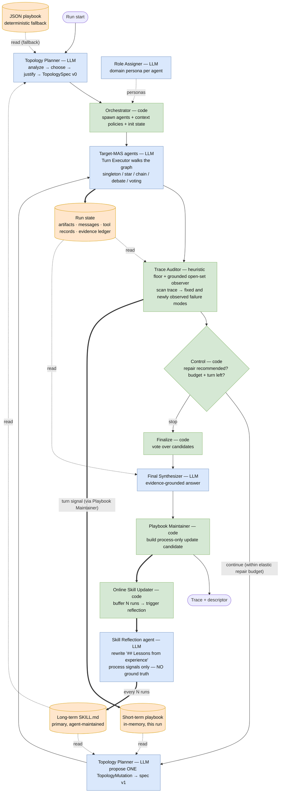

# Self-evolved topology system

Setting `topology = "self_evolved"` in `[mas]` replaces the fixed layout with one
the system designs per task (`MAS/self_evolved/`). Instead of running a
hand-picked topology, each run plans its own agent graph from the query, executes
it, audits its own trace for failure modes, and is allowed a bounded number of
structural repairs (`repair_budget`, default 4; each repair consumes a turn, so
effectively `min(repair_budget, max_turns - 1)`) before finalizing. It flows through the same CLI, artifact
hierarchy, and `summary.csv` as every other system, so it stays Q/C/D/R/P-comparable
to SAS and fixed MAS.

The orchestration is deterministic code; the LLM decides graph *shape* and does the
agent reasoning, but never decides when the loop stops. `benchmark.evaluate(...).success`
remains the only correctness authority — the in-run auditor never sees ground truth.

### Workflow diagram

Node fill marks the kind of component: **blue = LLM agent**, **green = deterministic
code**, **orange = state store**. **Solid arrows** are control flow / writes; **dashed
arrows** are reads. So you can read off *who writes each store and who reads it*.



Reading the stores off the diagram:

- **Run state** — written by the **Target-MAS agents** (and the synthesizer); read by the
  **Auditor** and **Synthesizer**.
- **Short-term playbook** — written each turn by the **Playbook Maintainer** (code) from the
  auditor's findings; read only by the **Planner** when it proposes the in-run mutation.
- **Long-term SKILL.md** — written by the **Skill Reflection agent** (LLM) every N runs from
  **process signals only**; read by the **Planner** for *both* the initial plan and the
  mutation. (The **JSON playbook** is the deterministic fallback when no skill file exists,
  written offline by `update_topology_playbook.py` — also process-only.)

The only LLM agents are the **Planner** (plan + mutate), the **Role Assigner**, the
**Target-MAS agents**, the **Final Synthesizer**, the **Skill Reflection agent**, and the
**Auditor** under the default `audit_mode = "hybrid"` (or `llm_judge`). Everything else — orchestration,
control, the maintainer, the updater, visibility — is deterministic code. No agent ever
sees the benchmark verdict.

### Turn lifecycle

Each run executes this loop (`MAS/self_evolved/engine.py::run`, with `max_turns = 5` by default):

1. **Plan** — load the long-term skill (`config/topology_skill.md`, or the JSON playbook
   fallback), then the LLM **Topology Planner** proposes a per-task `TopologySpec` (nested
   agents/groups + per-agent context policy). The
   planner prompt is an *analyze → choose → justify* scaffold: it first analyzes the
   task along three axes — **task type** (retrieval/search, reasoning, coding, tool use,
   state mutation, verification, planning, comparison, summarization…), **attributes**
   (ambiguity, need for parallelism/debate/verification, hallucination risk, whether
   external state is mutated, whether outputs aggregate), and **failure risks**
   (duplicated writes, thin search coverage, premature consensus, weak verification,
   poor decomposition) — then picks the topology that analysis implies and says what
   each agent does. The prompt carries **general, task-characteristic** topology
   guidance (no benchmark names): broad retrieval → several parallel searchers on
   different facets; dependent clue-chains → chain/debate (shared context); factuality
   risk → a verifier that re-checks evidence; **external state mutation → exactly one
   executor (singleton/chain), never a parallel write**; ambiguity → debate/voting;
   multi-part → star or tree. The planner's `task_analysis` is folded into the plan
   rationale so it is visible in the trace and the playbook candidate. If the LLM is
   mocked, unparseable, or errors, it falls back to a deterministic spec (`sas` for one
   agent, else `orchestrator_no_discussion`) and flags `used_fallback`.
   A planned `voting` group uses a four-agent diversity quorum when the effective agent
   budget permits; tighter tool/OOM caps still win. This prevents a dynamic vote from
   under-provisioning the four-agent static voting baseline. Debate and voting members also
   receive distinct independence contracts (direct derivation, alternative representation,
   falsification, and backward consistency checking), reducing correlated copies of one route.
   Before agreement counting, MANTA also recovers the last balanced explicit final form from a
   malformed structured wrapper, so equivalent answers are not split into false minorities by JSON
   escaping noise.
2. **Spawn** — project the spec to a real layout, assign domain personas, init state.
3. **Execute** — the **Turn Executor** walks the graph depth-first and runs each group
   by its pattern (`singleton` / `star` / `chain` / `debate` / `voting`). All agent
   work reuses the standard stage runner, so prompts, the tool loop, artifacts, and
   trace events match fixed MAS.
4. **Audit** — the **Trace Auditor** scans the turn's artifacts and tool records for
   process-observable failure modes: `tool_error_cascade`, `branch_collapse`,
   `evidence_lost_before_synthesis`, `premature_consensus`, `message_compaction_loss`,
   `missing_validator`, plus two coverage/side-effect modes —
   **`insufficient_search_coverage`** (a retrieval run that searched but opened no
   document, or had fewer than two agents searching a broad question) and
   **`duplicate_state_mutation`** (the same `(tool, arguments)` issued by ≥2 agents this
   turn, i.e. a double-applied write), and **`unsupported_impossibility_claim`** (a negative
   conclusion that simultaneously names an untested constructive transformation), and
   **`unverified_impossibility_consensus`** (every substantive candidate gives up, triggering
   one bounded adversarial attempt to construct a counterexample before abstention). The
   default `audit_mode = "hybrid"` also gives an
   open-set model observer the task, current/prior artifacts, evidence, and tool outcomes.
   It may name previously unseen failures, but a finding can spend repair budget only when
   it supplies exact quotes that deterministic code verifies against at least two distinct
   evidence refs, passes schema/confidence checks, and is structurally repairable. Structured
   chat prompts are split into `current_task`, `task_instructions`, and `recent_context`, so a
   few-shot example or earlier interactive step cannot masquerade as the live objective;
   it cannot erase deterministic findings. The deterministic consensus check is also
   state-transition aware: confident agreement on an explicit evidence action such as
   `search: ...` is allowed to execute even though the evidence it requests is necessarily still
   unresolved; low-confidence actions and unresolved proposed answers remain challengeable. Each
   mode carries an actionable recommendation (e.g. "add searcher
   workers on different facets", "serialize the write through one executor").
5. **Control** — deterministic ordered checks decide stop vs. continue. The *only*
   continue path is: the audit recommends a repair, mutation budget remains, and a turn
   remains. After a mutation, an unchanged semantic decision signature suppresses further
   agent growth and finalizes from the temporal incumbents; the larger ceiling is therefore
   reserved for repairs that actually change the decision. A grounded high-risk finding may
   challenge otherwise decision-grade consensus; deterministic code still owns the decision
   and all ceilings. Otherwise the run finalizes.
6. **Mutate** (continue path only) — the planner proposes one `TopologyMutation`
   (e.g. expand a leaf into a star or debate group, change a group pattern, add a
   searcher, collapse parallel workers into a chain to serialize a write). The mutation
   prompt carries the same long-term **skill** as the initial plan (so accumulated
   lessons shape the repair, not just the first design), the **short-term** turn memory,
   and a symptom→op cheatsheet so the audit verdict maps to a concrete op. It is applied
   once, visibility is revalidated, and the new spec runs one more turn. **Mutations are
   agent-additive** — agents are only ever added (`add_agent`, `expand_agent_to_group`),
   never deleted — but the graph is otherwise editable in place: `set_group_pattern`
   rewires a group's collaboration mode, `add_edge`/`remove_edge` adjust peer visibility,
   and `set_context_policy` retunes an agent's evidence access. Hard caps:
   `max_total_agents`, `repair_budget`, and `max_turns`. If the planner emits unusable
   mutation JSON, a conservative repair compiler maps the strongest grounded finding to a
   validated context/topology operation instead of silently dropping the repair. The next
   turn's agents receive the process diagnosis as explicitly untrusted evidence to verify,
   so the repair changes both graph structure and the reasoning target.
7. **Finalize** — vote over one preserved aggregate candidate from every executed turn
   (deterministic or judge), so a later mutation cannot silently overwrite a better incumbent. Evidence-grounded
   re-synthesis runs not only when the pick is empty/planning/blocked but also on a **weak pick**
   (an unbroken vote tie, winner confidence `< 0.5`, or open unresolved issues), and is skipped
   when no tool evidence exists — so confident, agreed answers are never disturbed. Failed and
   partial non-search tool records are retained as bounded negative evidence: they cannot become
   domain facts, but they drive an **epistemic fallback ladder**: preserve tool-verified entities
   and fields first; fill only responsibly known, durable missing attributes as explicitly
   approximate background; otherwise mark the field unknown and provide a part-by-part limitation
   plus concrete next action. It must not present background knowledge as current, personalized,
   complete, or tool-verified; high-stakes answers require a safety caveat.
   When no responsible partial answer is possible, it instead produces a complete failure report
   covering every requested part, the concrete limitation, any partial result, and a safe next step.
   Then record a
   **process-only** playbook update candidate (topology shape, auditor modes, termination signals —
   never the eval verdict) into `run_metadata`.
   If the task itself declares an explicit final-form contract and the selected answer violates it, a
   format-only enforcer may canonicalize the already-stated claim. It never sees the reference answer,
   never changes a contract-satisfying candidate, and keeps the incumbent unless the result satisfies
   the declared template.

The resulting trace reads `plan → spawn → turn 0 → audit → (revise → execute → audit)* → finalize`,
with meta-agent tokens/cost on their own events so `C*` includes meta-control overhead.
Every attempted mutation proposal (including invalid responses and deterministic compiler
fallbacks) and every applied mutation is retained in metadata for replay.

### Adaptive-repair evidence and evaluation boundary

Development runs validate the mechanism without yet claiming benchmark-wide superiority. A fresh
PlanCraft seed-42 gate completed **30/30 tasks successfully** with no run failures or fallbacks
(`manta_adaptive_plancraft_30x1_exhaustive_search_v2`). The same sampled sequence had already become
mathematically unable to clear the historical static threshold under the old no-search protocol
(20/28 before stopping); all eight observed failures were false impossibility conclusions, and all
eight exact failed episodes were rescued after the counterexample challenge plus exhaustive official
recipe search were enabled. This is encouraging single-seed evidence, not a matched comparison:
recipe search changes the observation protocol and benefits every topology.

The required matched rerun now confirms that point and supplies a fair current-protocol comparison.
On the identical 30 PlanCraft tasks, seed 42, Gemma model, five-agent ceiling, five-turn ceiling, and
official recipe-search observations, both MANTA and the strongest historical static topology
(`orchestrator_no_discussion`) reached **30/30 success**. MANTA used 86,670 mean tokens versus
112,189 (22.75% fewer), 131.9 mean trace steps versus 185.5 (28.88% fewer), and 53.5 seconds mean
latency versus 55.7 seconds (3.86% lower); it won the paired token comparison on 26/30 tasks and the
step comparison on 28/30. This establishes a quality tie with a substantial efficiency advantage on
one matched seed, not an all-benchmark or multi-seed victory. The completed MANTA run predates the
state-transition-aware retrieval exception above, so those cost numbers conservatively include some
unnecessary deliberation before executing agreed `search:` actions.

StableToolBench exact-seed replays target four systematic historical MANTA failure clusters
(`7658`, `13095`, `3510`, and `12204`; three original seeds each). The prior code solved 2/12 of
these episodes. The adaptive branch now receives a solved FAC verdict on 12/12: 11 runs are clean,
while one advertising run is correctly answered but marked `llm_or_tool_fallback` and still requires
a clean rerun. The recoveries came from three generic substrate/control changes rather than hidden
labels: structured future-tool plans now trigger the mandatory tool-use retry; the finalizer uses the
epistemic fallback ladder above instead of a global refusal; and topology planning counts independent
evidence sources rather than output fields, assigning a single retriever (plus at most one verifier)
when one structured dataset supplies the task. These ten recovered episodes exceed the historical
three-win deficit to the best static StableToolBench topology if every other outcome holds, but that
counterfactual is not a result—the full matched gate is still required to measure regressions.

The gate also exposed why an adaptive budget needs grounded control. Before quote anchoring, one
successful two-step episode (`VAL0229`) spent four internal turns and 64,096 tokens because the
open-set auditor confused a few-shot `iron_ingot` example with the live `cooked_salmon` task. After
separating structured prompt sections and verifying exact evidence quotes, an exact-seed replay kept
the success while using two turns and 29,962 tokens (53% fewer). This is a one-episode substrate
regression, not an aggregate cost claim; the pre-fix 30-task gate averaged 155,985 tokens and 136.6
seconds per task, so cost-aware matched evaluation remains necessary.

A separate three-example Math500 smoke solved two historically weak examples but left one geometry
example wrong after four agents reproduced the same arithmetic error. The latter is an important
limitation: more agents and open-set auditing do not guarantee genuinely independent reasoning.

Establishing that MANTA beats every static MAS requires a matched, multi-seed run on the same
benchmark snapshots and budgets. The appropriate study is an ablation of the prior MANTA settings,
hybrid audit only, adaptive repair only, temporal incumbents only, and the full system, reporting both
success and the existing Q/C/D/R/P descriptors. Benchmark verdicts must remain post-run evaluation
signals, never inputs to planning, auditing, control, or playbook retrieval.

For PlanCraft, the adapter enables a read-only `search: <item>` action over upstream's official
`RECIPES` objects by default (`[plancraft].recipe_search = true`). Search renders every accepted
ingredient alternative (rather than upstream's randomly sampled single valid grid), returns the
recipe as another environment observation, and consumes a step; it does not reveal the held-out
possibility label, optimal path, reward, or reference answer. Historical runs made before this
option was introduced used `recipe_search = false`, so publication comparisons must rerun every
topology under the same setting rather than mixing protocols.

### Playbook (two timescales)

- **Short-term** — an in-memory playbook, scoped to the **current run only** and never
  persisted. After each audited turn the Playbook Maintainer records the turn's process
  signals (detected modes, repair recommendation, termination reason) into it; the
  in-run repair planner reads it back, giving each mutation fresh turn-level context. It is
  born and dies with the run — it is *experience within a task*, not across tasks.
- **Long-term — an agent-maintained markdown skill.** The long-term playbook is a
  long-form `SKILL.md` (default `config/topology_skill.md`) that the planner loads **in
  full** — at both plan time and repair-mutation time — the way an agent consults a skill.
  It is *experience across tasks and runs*. It has three sections:
  - **Standing principles** — benchmark-agnostic laws always in force.
  - **How to choose a topology** — the task-type → topology heuristics.
  - **Lessons from experience** — concrete, evidence-cited rules grown from real runs
    (e.g. *"tool-using broad retrieval: chain/3 ran clean 2/2 where star/3 flagged
    insufficient_search_coverage 3× — breadth and document reading both matter"*).

  **No ground truth in the playbook — this is a research-validity requirement.** Ranking
  the long-term memory by `benchmark.evaluate(...).success` would leak the held-out label
  into the system under study, so the planner would effectively be reading the answer key.
  Instead every run contributes a **process-only proxy** — `is_process_clean`: the run is
  "clean" when the auditor flagged no failure modes *and* it reached decision-grade
  consensus. `benchmark.evaluate(...).success` stays the sole authority for *scoring*, but
  it never enters the planner's memory.

  **Writer = an LLM reflection agent.** Reflection gives the model the current skill plus
  recent runs summarized by **process signals only** (each run's `playbook_update_candidate`
  → clean/flagged + the auditor's flagged modes; `summary_from_candidate`) and asks it to
  rewrite the *Lessons* section in terms of which topologies run cleanly / avoid process
  failures — never "correctness". The Standing-principles / How-to-choose sections are
  protected (a guardrail rejects any revision that drops them; a mocked, too-short, or
  non-markdown reflection leaves the skill unchanged).

  - **Online (in-experiment) — the default, and the intended mental model.**
    `skill_update_batch_size = N` (default **12**, ≈4 tasks × 3 runs) under `[self_evolved]`. A single `run`
    command accumulates each freshly executed run's process-signal candidate and, **every N
    runs, pauses, reflects that batch into the skill, saves it, and reloads it**
    (`SelfEvolvedEngine.reload_skill`) so every subsequent run plans (and mutates) against
    the updated skill. Because the run loop is single-threaded, "pause → update → resume" is
    exactly what happens — the system genuinely self-evolves *during* the experiment. ⚠️ It
    writes a shared file mid-experiment, so run **one sequential process** — concurrent
    writers (e.g. parallel benchmarks in `scripts/full_experiment.sh`) would race; set
    `skill_update_batch_size = 0` for those. A trailing partial batch (< N) is picked up by
    the offline pass.
  - **Offline (opt-out / re-reflection).** Set `skill_update_batch_size = 0` to disable
    online writes (parallel-safe), then re-reflect over a finished experiment with
    `python scripts/reflect_topology_skill.py --experiment-root <dir> --config <toml>`. It
    reads the same process-signal candidates from disk — **not** `eval.json` — so it stays
    ground-truth-free too.

  *Deterministic fallback.* When no skill file exists, the planner falls back to the legacy
  structured JSON playbook (`config/topology_playbook.json`): benchmark-agnostic
  `principles[]` plus per-`benchmark::tools|size`-key `entries[]` whose `notes` distil a
  `best (cleanest)/avoid` rule, retrieved in three tiers (exact key → same benchmark → **same
  task shape across other benchmarks**, the transfer tier). It is written offline by
  `scripts/update_topology_playbook.py`, which merges run candidates **ranked by the same
  process proxy** (deterministic, no LLM, no `eval.json`). The markdown skill is the primary
  memory; the JSON is the fallback/record. Both keep the benchmark verdict out of the loop.

### Design notes: roles, mutation, and state

**Does the planner assign agent roles?** Two layers, only one of them the planner's:

- **Structural roles** (`coordinator` / `worker` / `debater` / `voter` / `verifier`) — the
  planner sets these *implicitly*. It picks a group **pattern** and an optional `verifier`
  flag; deterministic code (`planner._build_spec`, `_apply_*` for mutations) expands that
  shape into concrete per-agent structural and stage roles. The planner chooses the
  topology; code derives the roles.
- **Domain personas** (e.g. *"flights API specialist"*) — **not** the planner. A separate
  **Role Assigner** (`MAS/role_assigner.py`, an independent LLM call in
  `engine._assign_personas`, with a deterministic fallback) attaches a benchmark-specific
  persona to each agent. Agents added by a mutation get deterministic personas with no extra
  LLM round-trip. Per the prompt-priority invariant, personas never override stage behavior.

**Is the mutation add-only?** **Agents are add-only** — there is no remove-agent op, so the
agent set grows monotonically and is bounded by `max_total_agents`. The rest of the graph is
**editable in place**: `set_group_pattern` changes a group's collaboration mode (e.g.
parallel → chain to serialize a write), `add_edge`/`remove_edge` adjust peer visibility, and
`set_context_policy` retunes an agent's evidence access. So: additive in agents, mutable in
structure, one mutation per repair turn, capped by `repair_budget` per run.

**How does the orchestration manage state across a mutation?** The run owns **one mutable
`state` dict** for its whole life; a mutation never resets it.

- **Nothing accumulated is discarded.** `messages`, `artifacts`, `tool_records_log`, and the
  append-only **evidence ledger** carry across the mutation, so turn-2 agents (including
  newly spawned ones) see turn-1 work.
- **The mutation only swaps the graph.** Code installs the new `TopologySpec`, refreshes
  `layout`, and calls `context.set_spec(new_spec)`; visibility reads are **lazy**, so they
  simply recompute against the new topology — no migration step. New agent ids get budget +
  persona bookkeeping (`_register_new_agents`); existing agents keep their counters.
- **Visibility is code, never prompts.** `SharedContextController` + each agent's
  `ContextPolicy` apply recipient/kind/round filtering, latest-per-sender selection, sender
  share-scope, and optional summary-only/packet bounds.
- **Everything is logged for replay.** Every `TopologySpec` lands in
  `topology_spec_versions`; a `context_state_versions` snapshot is appended on spawn and on
  each mutation; meta-agent (planner/auditor/synthesizer) tokens ride their own trace events
  so `C*` includes meta-control overhead. Agents never decide termination — the controller
  does — and `benchmark.evaluate(...).success` stays the sole correctness authority **for
  scoring**; it is deliberately kept out of the planner's playbook (which learns from process
  signals only), so the self-evolved system never trains on the verdict it is measured by.

### Correctness nets and provisioning (deterministic code)

Two failure modes a 31B-class planner will not reliably avoid on its own are handled in
code, independent of the prompt:

- **Duplicate side-effects** — `TurnExecutor` keeps a per-run ledger of executed
  `(tool, arguments)` signatures and drops a tool record whose signature already ran, so an
  identical state-changing call (e.g. `calendar.create_event`) is recorded — and therefore
  replayed by the evaluator — **exactly once** even if parallel workers each issue it.
  Distinct arguments are always kept, so diverse parallel search is unaffected.
- **Retrieval breadth** — retrieval runs (those exposing `get_document`) run a single turn
  (no repair doubling) and keep the full configured agent budget instead of the 3-agent cap
  used for other tool tasks, because broad multi-hop search needs several searchers covering
  different facets; a near-single searcher is the dominant retrieval failure.

### Config and backend

```toml
[self_evolved]
harness_backend = "openrouter"   # or "claude_agent_sdk"
max_initial_agents = 5
max_total_agents = 10            # hard cap on topology size after mutations
max_turns = 5                    # 1 initial turn + up to (max_turns - 1) repair turns; the
                                 # controller stops early on a decision-grade answer.
                                 # Retrieval tasks are force-capped to 1 turn (OOM guard).
repair_budget = 4                # repair mutations per run; effective = min(repair_budget, max_turns - 1)
audit_mode = "hybrid"            # grounded open-set observer + heuristic safety floor;
                                 # alternatives: "heuristic" or "llm_judge"
playbook_path = "config/topology_playbook.json"
skill_path = "config/topology_skill.md"   # the long-term agent-maintained skill
playbook_read = true             # planner reads the skill (used in BOTH plan and mutation)
skill_update_batch_size = 12     # default 12 (≈4 tasks × 3 runs): reflect into the skill online every N
                                 # runs (use one sequential process). 0 = off (offline only, parallel-safe)
default_packet_max_chars = 0     # 0 = full fidelity; a positive value is a generous structural-compaction budget
```

The expert-agent harness is switchable via `harness_backend`: `"openrouter"` (default,
mock mode preserved for offline tests) or `"claude_agent_sdk"` (needs
`pip install -e ".[claude]"` and `ANTHROPIC_API_KEY`). `C*` cost metrics are not directly
comparable across backends — the Claude Agent SDK runs its own internal agent loop, so its
per-stage token/latency totals are cumulative — so treat the backend as an experiment dimension.

### Verification on hard, previously-failed examples

The optimization above was verified on the hardest examples where the original self-evolved
system lost to the static MAS baseline
(`artifacts/full_experiment/20260427T134706Z__google_gemma_4_31b_it_nitro`), model
`google/gemma-4-31b-it:nitro`, **1 run per task**:

| benchmark | task | failure mode | SAS | best static | old self-evolved | **optimized self-evolved** |
|---|---|---|----:|----:|----:|:--|
| workbench  | multi_domain_25 | duplicate write | 3/3 | 3/3 | 1/3 | **✅ pass** (chain, 1 write) |
| workbench  | multi_domain_28 | duplicate write | 3/3 | 3/3 | 1/3 | **✅ pass** |
| workbench  | multi_domain_29 | duplicate write | 3/3 | 3/3 | 1/3 | ❌ fail¹ |
| browsecomp | 791             | under-search + no read | 0/3 | 3/3 | 0/3 | **✅ pass** → `JadaL` |
| browsecomp | 796             | under-search + no read | 0/3 | 3/3 | 0/3 | **✅ pass** → `Odeal` |
| browsecomp | 773             | multi-hop, deep gold | 0/3 | 1/3 | 0/3 | ❌ fail² |

On these six previously-lost tasks the optimized system goes from **0/6 → 4/6**, recovering the
two browsecomp cases only the best discussion topology could win (SAS itself scores 0/3 there).

- ¹ md_29's single run was degraded by `:nitro` provider timeouts; the dedup net still held
  (`unwanted_side_effects=false`), so the duplication regression is fixed — the loss is
  provider noise, not the bug.
- ² 773 is the hardest case (even the best static system scores only 1/3): the gold document
  ranks low and the answer needs deep multi-hop refinement the 31B model does not complete in one
  pass.

**Reproduce:**

```bash
# optimized self-evolved on the hard subset (static + old self-evolved numbers are read from
# the stored baseline experiment dirs above)
python main.py run --config config/verify_selfevo_fix.toml --benchmark workbench \
  --task-ids multi_domain_25,multi_domain_28,multi_domain_29 --runs-per-task 1 \
  --output-dir artifacts/opt_verify --output-layout hierarchical \
  --experiment-id opt_selfevo_v1 --system-label self_evolved
python main.py run --config config/verify_selfevo_fix.toml --benchmark browsecomp \
  --task-ids 791,796,773 --runs-per-task 1 \
  --output-dir artifacts/opt_verify --output-layout hierarchical \
  --experiment-id opt_selfevo_v1 --system-label self_evolved

# With skill_update_batch_size > 0 (default 12) the skill self-evolves online during the run
# above — no extra step. To instead re-distil process-only experience offline (e.g. for the
# JSON fallback, or after a parallel run with online updates disabled):
python scripts/update_topology_playbook.py --experiment-root artifacts/opt_verify/opt_selfevo_v1
```

Known limitation: `google/gemma-4-31b-it:nitro` is non-deterministic at temperature 0 and the
throughput route occasionally times out, so single-run results carry provider noise; the
structural fixes (dedup net, read-net, breadth) are deterministic and provider-independent.
